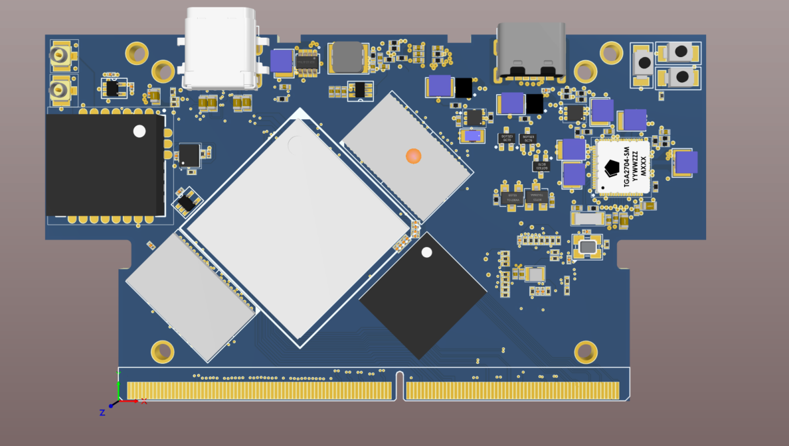

\# SOM\_BOARD with RK3399 Processor

---

\## Description:

This project is a \*\*high-speed System on Module (SOM)\*\* board built around the Rockchip \*\*RK3399\*\* processor. It is designed as a central processing module that can be integrated into a wide range of embedded systems and products.  

The SOM integrates high-performance LPDDR4 SDRAM, eMMC storage, dual-band Wi-Fi/Bluetooth, and a complete power management solution. It exposes a rich set of high-speed and multimedia interfaces via a \*\*260-pin DDR4 connector\*\*, making it ideal for applications in AI, multimedia processing, and high-performance embedded computing.

---

\## Features:

\- \*\*Processor:\*\* Rockchip RK3399 – 6-core CPU (Dual Cortex-A72 + Quad Cortex-A53) with Mali-T860MP4 GPU  

\- \*\*Memory:\*\* 2 × LPDDR4 SDRAM (2 GB each) – total 4 GB capacity  

\- \*\*Storage:\*\* 16 GB eMMC for OS image and data storage  

\- \*\*Wireless:\*\* Dual-band Wi-Fi (2.4 GHz \& 5 GHz) + Bluetooth over SDIO  

\- \*\*Power Management:\*\* Dedicated PMIC for stable power delivery, with processor shutdown/sleep support  

\- \*\*USB Type-C (Data \& Debug):\*\* For image flashing and application debugging  

\- \*\*USB Type-C (Power):\*\* Independent power input for SOM operation  

---

\### High-Speed Interfaces (via 260-pin DDR4 Connector):

\- \*\*Display:\*\* MIPI-DSI, eDP, HDMI  

\- \*\*Camera:\*\* MIPI-CSI  

\- \*\*Expansion:\*\* PCIe, USB 2.0 \& USB 3.0 hosts, GPIOs, 3× Analog inputs  

\- \*\*Networking \& Peripherals:\*\* Supports external modules via exposed high-speed lanes  

---

\### Design Tools:

\- Schematic and PCB layout designed in \*\*Altium Designer\*\* 

---

\## 2D View:

&nbsp; 

&nbsp; 

&nbsp; 

&nbsp; 

---

\## 3D View:

&nbsp; 

&nbsp; 

